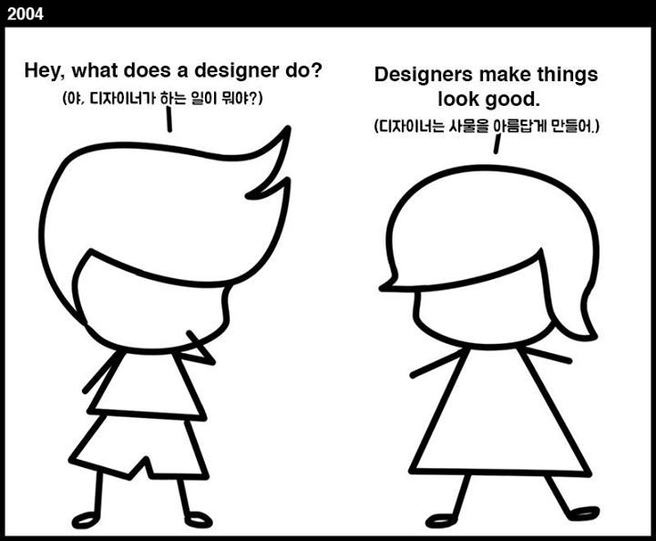
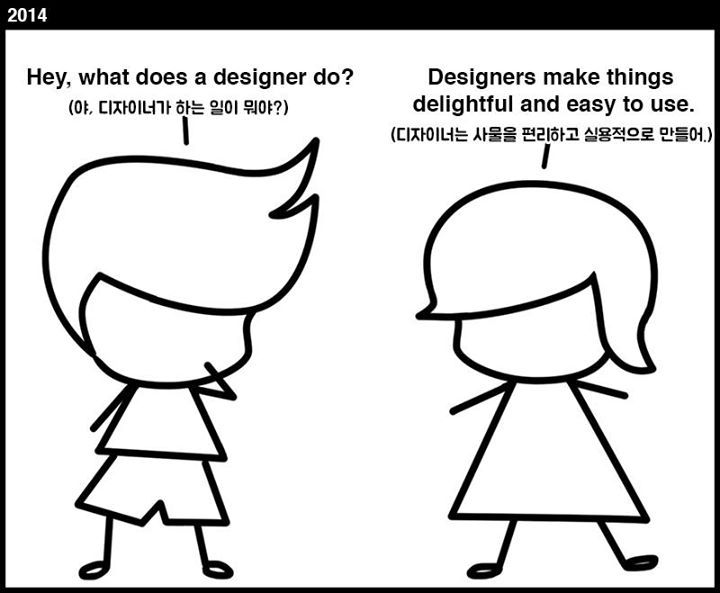
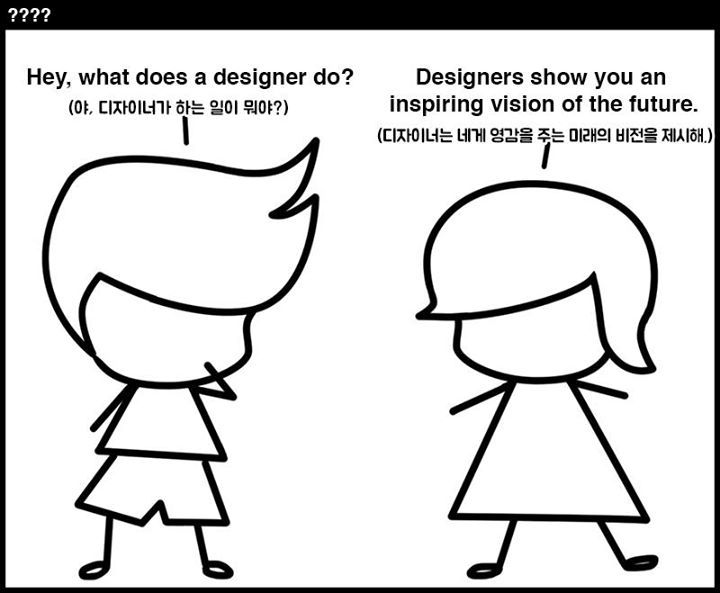

# 웹강좌

디자이너는 어떠한 일을 할까요?

외국의 유명한 자료에는 아래처럼 이야기 합니다. 

 

과거의 디자이너는 사물을 아릅답게만드는 것을 기초로하여 제작되었지만,  이제는 그 사물의 실용성과 의미를 부여하고 있습니다. 

  

앞으로의 미래는 더 나은 미래에대한 비전을 제시하고 그 방향성을 얻을 수 있는 것이 디자이너의 업무로 볼 수 있습니다.

  

디자이너의 비전을 위해 참고할 만한 사이트를 모았습니다.  부족하다면 더 많은 자료를 모아 첨부하도록 하겠습니다. 

---

### 우수웹디자인 평가사이트

#### 국내

1. https://www.dbcut.com
2. http://www.gdweb.co.kr
3. http://www.ideanote.co.kr/
4. http://www.i-award.or.kr/Web/
5. https://designmodo.com/
6. https://www.siteinspire.com/websites?categories=180

#### 해외

1. https://thefwa.com/
2. http://www.awwwards.com/
3. https://www.cssdesignawards.com
4. https://www.cssawards.net/

### 일본

1. http://bm.straightline.jp/

---

### 반응형웹 확인

1. https://mediaqueri.es/

---

### 접근성

1. http://www.wah.or.kr/
2. http://wa.or.kr/
3. http://www.kwacc.or.kr/
4. http://www.webwatch.or.kr/
5. [**웹소울랩: ** http://www.websoul.co.kr/](http://www.websoul.co.kr/)
6. [**네이버-널리:** http://nuli.navercorp.com/sharing/a11y/awareness](http://nuli.navercorp.com/sharing/a11y/awareness)
7. [**평창올림픽 블로그: ** https://www.pyeongchang2018.com](https://www.pyeongchang2018.com/ko/blog/%EC%8B%9C%EA%B0%81%EC%9E%A5%EC%95%A0%EC%9D%B8%EC%9D%84-%EC%9C%84%ED%95%9C-%EC%9B%B9-%EC%A0%91%EA%B7%BC%EC%84%B1-Web-accessibility)

---

### html5 정규표현식 체크: 

http://html5pattern.com/

---

### web reference(규정가이드 체크)

1. http://htmlreference.io/
2. http://cssreference.io/
3. http://devdocs.io/
4. ​

---

### 웹표준자료

1. https://www.koreahtml5.kr/jsp/infoSquare/infoStandardDoc.jsp
2. https://developer.mozilla.org/ko/
3. https://www.w3schools.com/
4. ​

---

### 웹 사용성 체크

1. https://caniuse.com/
2. https://www.browserstack.com/
3. ​

---

### 코딩 단축키 확인

1. https://emmet.io/
2. https://ahndohun.github.io/emmet-game/

---

###  웹표준학습사이트

1. https://ko.khanacademy.org/
2. https://beecanvas.com/
3. http://darum.daum.net/
4. http://nuli.navercorp.com/

---

### cdn

https://unpkg.com/#/

---

### 그래픽

- http://abduzeedo.com/
- http://www.designspoon.com/

---

### css frameworks

**부트스트랩**

- http://bootstrapk.com/
- http://getbootstrap.com/

**bulma**

- https://bulma.io/

  ​

---

### 기타 학습사이트

**scss: ** 

- https://sass-guidelin.es/ko/
-  http://www.sass-lang.com/

**handlebarsjs: **

- http://handlebarsjs.com/

- http://tryhandlebarsjs.com/

**nodejs:**

- http://nodejs.org

- https://node.university/courses?src=wal-bar

**typescript:**

- https://www.typescriptlang.org/
- https://www.tutorialspoint.com/typescript/typescript_tutorial.pdf

**vue.js:**

- https://kr.vuejs.org/v2/guide/comparison.html
- http://vuejs.kr/vue/epub/2017/05/10/introduce-generate-vue-book/

**jquery:** 

- http://jquery.com/
- http://direct.co.kr/cs/jQuery.pdf

**react:**

- https://reactjs.org/
- https://www.youtube.com/watch?v=GEoNiUcVwjE&list=PL9FpF_z-xR_GMujql3S_XGV2SpdfDBkeC

**gulp**

- https://gulpjs.com/

**webpack**

- https://webpack.js.org/
- http://webpack-korea.org/

- https://www.youtube.com/playlist?list=PLpkj8RKr48wY2RgNIvcnIWram82a0ZXa8

**종합IT강좌:**

- https://www.inflearn.com/
- https://tutsplus.com/
- https://opentutorials.org/course/1
- http://webframeworks.kr
- http://poiemaweb.com/
- http://d2.naver.com/home
- ​

**개인블로그참고학습사이트:**

- https://velopert.com/
- https://www.zerocho.com/portfolio

**오프라인강좌:**

- http://dnomade.com/web/m_intro.php
- http://onoffmix.com/

**다양한 키노트자료:**

- https://www.slideshare.net

  ​

---

