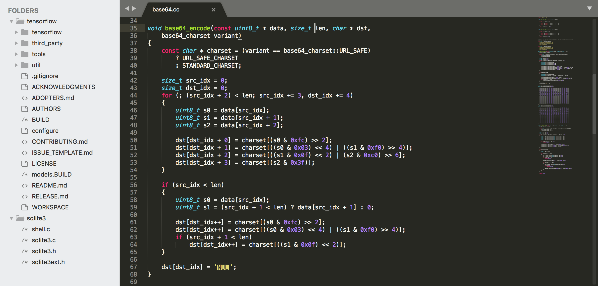
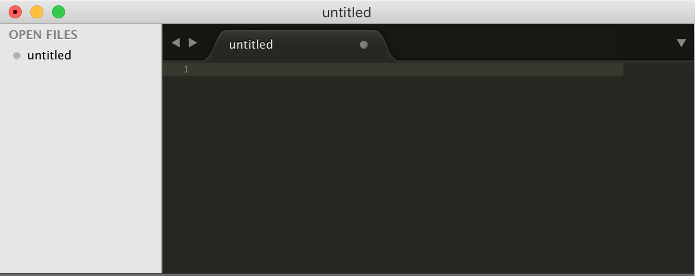
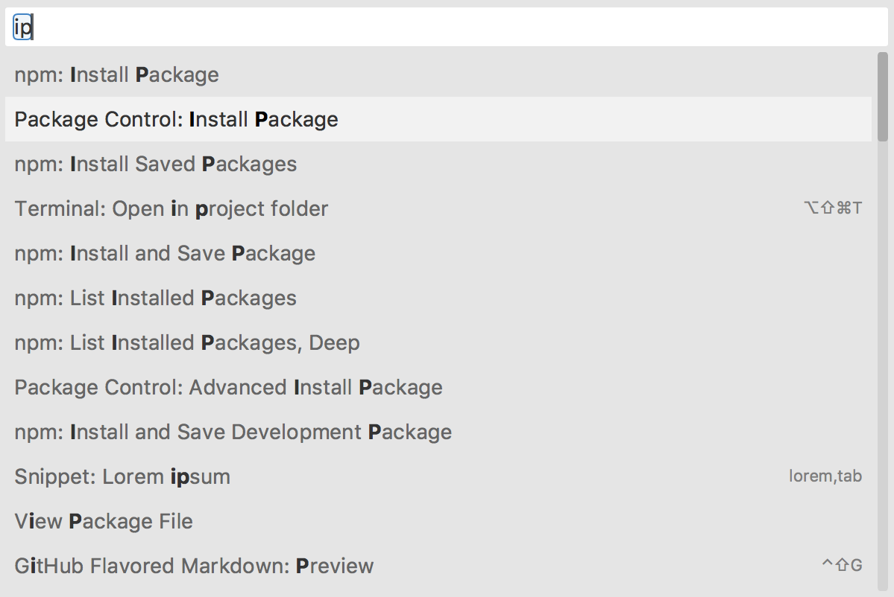

# Sublimetext

웹 코드를 작성하려면 이를 작성하고 수정이 용이하도록 제작하는 에디트가 필요합니다. 
다양한 os에서도 문제없이 구동되고 사용 용량이 작으며   <br />컴퓨터의 사양을 많이 타지 않는 프로그램이 [Sublimetext](https://sublimetext.com)가 아닐까 생각합니다. 

가볍고 간편하며 가장 많은 사용자를 가지고 있는 프로그램이기도 합니다.  <br />
하지만 아쉽게도 무료 프로그램은 아닌 유료입니다. <br />
약 500여회 정도 저장하면 이후 간헐적으로 유료구매를 요구합니다. <br />
비용은 **$80**로 비싼 배용은 아닙니다만, 처음부터 구매후 사용하시는 것 보다는 다양한 에디트를 사용해보시고, <br />
구매 결정하시는 것도 좋습니다. (일부기능은 정품이어야 편하게 동작하는 기능도 있습니다. )




---

[TOC]

---

## 설치

먼저 [sublimetext](https://sublimetext.com/) 페이지로 이동합니다. 

- 화면 중/상단에 보이는 **Download For (Windows or MAC)**버튼을 클릭하면 <br /> 자동으로 해당 OS에 맞는 프로그램을 다운받을 받을 수 있습니다. 이후에 컴퓨터에 설치하시면 됩니다.


- 버전이나 여러 OS를 한번에 받으려면 화면상단의 메뉴에 있는 [**download**](https://www.sublimetext.com/3)버튼을자 클릭하여 <br />해당 OS를 선택하여 설치하는 방법도 존재합니다. 


위 내용중 확장자를 확인하여 해당하는 OS에 맞는 것을 선택하면 됩니다. 

- windows 사용자는 확장자가 **msi**인 파일을 다운받게 됩니다.
- mac 사용자는 확장자가 **dmg**인 파일을 다운받게 됩니다.
- linux 사용자는 확장자가 **deb**인 파일을 다운받게 됩니다.

---

## Sublimetext 실행

최초의 시작화면은 다음과 같습니다.



복잡한 내용없이 깔끔하게 보이는 화면입니다. 
상단의 메뉴바는 각 OS마다 다르게 보입니다.


>  for mac

 

> for window

약간의 차이는 보이지만 크게 다른점은 없습니다.


---

## Sublimetext 플러그인 설치전 세팅 및 테스트

sublimetext는 다양한 플러그인을 설치하여 기본 프로그램을 세팅해야합니다. <br />
다양한 플러그인을 설치하기 위해서는 플러그인을 설치하기 위한 기본 설정을 해야합니다.

1. **`메뉴 > tools > Command palette`** 을 클릭합니다.

    
    > 메뉴 &gt; tools &gt; Command palette

    

2. 화면상에 창이 나올때 **`Install Package`**를 검색하여 Package Control을 설치합니다. <br />
    설치 되는 동안 왼쪽 하단에 `[   =]` 표시가 나타나며, 표시가 사라지면 이상없이 설치되었다는 메시지창이 나타납니다.

    
    > package controls를 선택하여 설치하세요.

    

3. 이제 다양한 플러그인을 설치할 수 있습니다.  <br />windows 와 mac모두 기본적으로 설치해야하는 플러그인 하나를 먼저 설치해서 테스트 해보도록 하겠습니다.

    1. 처음과 마찬가지로 `메뉴 > tools > Command Palette`를 선택합니다.
    2. 검색창에서 `Install Package` 를 검색하여 선택합니다.(간단하게 **ip**라고 입력해도 나타납니다.)
    3. **convert utf8** 를 검색하여 `convert to utf8` 를 설치합니다. 

    

     

    > **tools > command palette** 선택시 검색창에서 **install package**를 선택

    

     

    > package 창에서 **utf8**을 입력하여 **ConvertToUTF8**을 설치

    

     

    > 해당 package 설치중인상태(화면상 왼쪽 하단에 표기), 메시지가 사라지면 설치 완료

이외에도 설치된 팩키지 중지, 재동작, 삭제 등을 처리할 수 있습니다.
이는 모두 `메뉴 > tools > command palatte` 에서 처리합니다.

---

## 다양한 플러그인 설치

### 세팅 요약

플러그인 설치방법을 한번더 간단하게 요약하겠습니다.

1. `메뉴 > tools > command palette` 클릭
2. 화면중간 검색창이 나타나면 `install package` 입력후 선택(선택시 자동으로 install package창으로 이동)
3. `install package` 검색창으로 이동 후 필요한 **package**를 검색하여 설치
4. 설치중에는 왼쪽하단에 `[   =]` 기호가 움직이면서 설치중이라는 메시지를 보여주며, 완료시 사라짐
5. 몇몇 팩키지의 경우는 화면에 설명서를 띄워줌
6. 설치된 팩키지를 확인하려면 **tools > command palette** 에서 **list package**를 선택하면 확인할 수 있음
7. 설치된 팩키지에서 작동중지하려면 **tools > command palette** 에서 **disable package** 내부에서 **package**를 선택하면 동작되지 않음
8. 설치된 팩키지 중 중지된 팩키지를 동작하게 하려면 **tools > command palette** 에서 **Enable package** 내부에서 **package**를 선택하면 재동작처리됨
9. 설체된 팩키지를 삭제하려면 **tools > command palatte** 에서 **remove package** 를 입력 후 삭제할 **package**를 선택하여 삭제할 수 있음


---

### 설치할 package

위 사항을 기반으로 필요한 기능을 몇가지 설명하도록 하겠습니다.

- **conver to utf8** : utf-8 형식이 아닌 문서를 강제로 변환처리하는 기능 <br />
                             (일부기능에서만 동작하므로 메모장에서 기본 수정 처리할 것을 권장)

- **IMESupport** : windows에서만 설치할 것을 권장하는 package로서 한글 작성의 반응속도를 높이는 기능

- **Sidebar Enhancement** : 사이드바의 메뉴트리에 관한 정보를 다양하게 처리할 수 있는 기능 <br />            (사이드바에서 오른버튼클릭시 다양한 메뉴나옴, **view > sidebar > …** 에서 사이드바를 켜고 끌 수 있다.)

- **Brackets Highlighter** : html 코드의 시작과 끝의 위치를 파악하는 기능

- **Markdown preview** or **Markdown Slide Show** : markdown문서를  작성하고 볼 수 있는 기능

- **Color Highlighter** : 컬러코드 작성시 작성된 색상을 확인할 수 있는 기능

- **Increment Section** : 연속된 숫자를 작성시 쉽게 작성해주는 기능

- **Emmet** : html/css 문서를 쉽게 작성하게 만들어주는 단축키 기능

- **beautify** and **minify** : 문서를 보기좋게 또는 한줄로 만들어주는 기능

- **Auto File Name** : 작성되는 코드 위치를 파악하여 위치에 맞는 파일을 찾아주는 기능(일부는 수정해야함)

- **view in browser** : 현재 문서(html)를 브라우저에서 바로 실행해서 확인하는 기능(로컬로 확인하기)

- **Alignment** : 문서내의 일부코드를 정렬하는 기능(단축키를 사용하여 각각의 라인에서 설정)

- **Boxy Theme** : sublimetext의 대표 테마

  - **windows** : preference  > theme(일부는 Color theme)에서 테마를 선택할 수 있다. 
  - **mac** : sublimetext > preference > theme(일부는 Color theme)에서 선택할 수 있다.

  

---

## 알아두면 좋은 팁

### 단축키

sublimetext는 다양한 단축키가 존재합니다.  <br />
몇가지 단축키를 사용한다면 더욱더 빠르고 편하게 사용할 수 있습니다.

- 여러줄 한번에 선택하기
- 코드 일부선택하여 감싸는 코드를 작성하기
- 동일한 단어 찾기
- 사이드바 켜고 끄기
- 여러코드 접기/펴기
- 주석 달기
- 화면분할하기

등 위의 기능들을 표로 첨부하였습니다.

| 편집                                    | OS X                 | Window            |
| --------------------------------------- | -------------------- | ----------------- |
| 단어 다중 선택                          | Cmd + D              | Ctrl + D          |
| 선택한 단어 모두 선택                   | Cmd + Ctrl + G       | Alt+F3            |
| 하나씩 선택 취소                        | Cmd + U              | Ctrl + U          |
| 다중선택시 현재 단어 배제               | Cmd + KD             | Ctrl + KD         |
| 단어 선택 모두 취소                     | ESC                  |                   |
| 한줄씩 선택                             | Cmd + L              | Ctrl + L          |
| 들여쓰기                                | Cmd + ]              | Ctrl + ]          |
| 내어쓰기                                | Cmd + [              | Ctrl + [          |
| 들여쓰기 맞춰서 붙여넣기                | Cmd + Shift + V      | Ctrl + Shift + V  |
| 들여쓰기 레벨이 같은 내용 선택          | Ctrl + Shift + J     |                   |
| 현재 줄 주석으로 만들기                 | Cmd + /              | Ctrl + /          |
| 현재 위치에서 주석 만들기               | Cmd + Alt + /        | Ctrl + Shift + /  |
| 현재 줄을 다음줄에 복붙하기             | Cmd + Shift + D      | Ctrl + Shift + D  |
| 커서 영역 코드를 줄 위로 이동           | Cmd + Ctrl + ↑       | Ctrl + Shift + ↑  |
| 커서 영역 코드를 줄 아래로 이동         | Cmd + Ctrl + ↓       | Ctrl + Shift + ↓  |
| 선택한 단어 태그로 감싸기               | Ctrl + Shift + W     | Alt + Shift + W   |
| 현재 줄 잘라내기                        | Cmd + X              | Ctrl + X          |
| 커서영역 줄 삭제                        | Ctrl + Shift + K     |                   |
| 현재 라인 뒤에 입력하기                 | Cmd + ↩              | Ctrl + ↩          |
| 현재 라인 앞에 입력하기                 | Cmd + Shift + ↩      | Ctrl + Shift + ↩  |
| 현재 문서 맨 위로 이동                  | Cmd + ↑              |                   |
| 현재 문서 맨 뒤로 이동                  | Cmd + ↓              |                   |

| 찾기                                    | OS X                 | Window            |
| --------------------------------------- | -------------------- | ----------------- |
| 찾기                                    | Cmd + F              | Ctrl + F          |
| 찾아 바꾸기                             | Cmd + Alt + F        | Ctrl + H          |
| 원하는 위치에서 (폴더 or 프로젝트) 찾기 | Cmd + Shift + F      | Ctrl + Shift + F  |
| 빠른 파일 찾기                          | Cmd + P or Cmd + T   | Ctrl + P          |
| 심볼 찾기                               | Cmd + R              | Ctrl + R          |
| 단어 찾기                               | Cmd + ;              | Ctrl + ;          |
| 라인번호로 이동하기                     | Ctrl + G             |                   |

| 일반                                    | OS X                 | Window            |
| --------------------------------------- | -------------------- | ----------------- |
| 커멘드 팔렛트                           | Cmd + Shift + P      | Ctrl + Shift + P  |
| 콘솔 창 오픈                            | Ctrl + `             |                   |
| 풀스크린 모드                           | Ctrl + Cmd + F       |                   |
| 사이드바 토글                           | Cmd + KB             | Ctrl + KB         |

| 탭                                      | OS X                 | Window            |
| --------------------------------------- | -------------------- | ----------------- |
| 왼쪽 탭으로 전환                        | Cmd + Shift + [      | Ctrl + PgUp       |
| 오른쪽 탭으로 전환                      | Cmd + Shift + ]      | Ctrl + PgDn       |
| 마지막으로 열었던 탭 열기               | Cmd + Shift + t      | Ctrl + Shift + t  |
| 탭 닫기                                 | Cmd + W              | Ctrl + W          |

| 창 분할                                 | OS X                 | Window            |
| --------------------------------------- | -------------------- | ----------------- |
| 창 한개로 보기                          | Cmd + Alt + 1        | Alt + Shift + 1   |
| 창 2개로 보기                           | Cmd + Alt + 2        | Alt + Shift + 2   |
| 창 3개로 보기                           | Cmd + Alt + 3        | Alt + Shift + 3   |
| 창 4개로 보기                           | Cmd + Alt + 4        | Alt + Shift + 4   |
| 田 모양 4개로 보기                      | Cmd + Alt + 5        | Alt + Shift + 5   |
| 아래 위 2개로 보기                      |                      | Alt + Shift + 8   |
| 원하는 창번호로 커서 이동               | Ctrl + [NUM]         |                   |
| 원하는 창번호로 문서 이동               | Ctrl + Shift + [NUM] |                   |

| 북마크                                  | OS X                 | Window            |
| --------------------------------------- | -------------------- | ----------------- |
| 북마크 지정하기                         | Cmd + F2             | Ctrl + F2         |
| 다음 북마크로 이동하기                  | F2                   |                   |
| 이전 북마크로 이동하기                  | Shift + F2           |                   |
| 북마크 클리어 하기                      | Cmd + Shift +F2      | Ctrl + Shift + F2 |

| 대소문자 전환                           | OS X                 | Window            |
| --------------------------------------- | -------------------- | ----------------- |
| 단어 대문자로 바꾸기                    | Cmd + KU             | Ctrl + KU         |
| 단어 소문자로 바꾸기                    | Cmd + KL             | Ctrl + KL         |

> 자료: 생활코딩(https://opentutorials.org/module/2251/12834)

---

### shell(CLI)에서 sublimetext 실행하기

sublimetext를 사용하다보면 하나의 디렉토리에서 사용하기보다는  <br />다양한 디렉토리에서 다양한 파일을 사용하는 경우가 많습니다.

이러한 경우에는 shell프로그램을 사용하여 sublimetext를 쉽게 열어 사용하는 방법이 필요합니다.  <br />
각 OS별로 동작하게 하는 방법이 다르므로 아래 기능을 확인하여 사용하시기 바랍니다.

상황과 내용을 동일하게 처리하기 위해 **windows OS** 에서는 [git-scm](https://git-scm.com/downloads) 에서 **git-bash**를 통한 기능으로 설명하겠습니다.  <br /> **mac OS** 에서는 기본 **terminal** 을 통해 동작하는 것으로 설명하도록 하겠습니다.


---

#### windows

1. 먼저 windows는 sublimetext가 설치된 위치를 탐색기로 찾아야 합니다.  <br />특별히 위치를 설정하지 않았다면, `c:/program files/sublime text 3` 를 기본 위치로 설정하게 되어 있습니다.
2. **내컴퓨터**에서 마우스 **오른버튼**을 클릭하여 **시스템 속성**을 선택합니다.
3. 왼쪽 탭메뉴에서 고급 시스템설정버튼을 클릭하여 별도의 창이 나오는 것을 확인 후, <br /> 시스템설정 창에서 하단의 환경 변수 버튼을 클릭합니다.
4. 이곳에서 부터 window 7버전과 window 10버전의 기능으로 나뉘어 설정할 수 있습니다.
   - **window 7**
     1.  **환경변수창**에서 **하단 시스템변수**란에 위치한 **새로만들기(new)**버튼을 선택합니다. 
     2.  **새시트템변수창**이 나타나면 상단 변수명에 **sublime** 으로 입력후,
     3.  **새시트템변수창** 하단의 값을 sublimetext가 설치된 경로 **`c:/program files/sublime text 3`**를 입력 후 **OK** 버튼을 클릭하여 변수를 저장합니다.
     4.  다시 **환경변수창**에서 하단 **시스템 변수** 란에서 **path란을 선택**합니다.
     5.  **path선택** 후 하단 **편집(edit)** 을 클릭하여 시스템변수창을 띄웁니다.
     6.  **시스템 변수 창**에서 하단의 값을 선택후 해당 라인의 끝항목(키보드 end키를 눌러 커서를 마지막으로 위치)에서 **`;%sublime%`** 를 입력 후 **`OK`** 를 눌러 설정하면 됩니다.
   - **window 10**
     1.  **환경변수창**에서 **하단 시스템변수**란에 위치한 **새로만들기(new)**버튼을 선택합니다. 


5. **windows** 에서는 사용할 디렉토리에서 shell프로그램을 동작하기 위해  <br />마우스 오른버튼을 클릭 후 **git bash** 실행하기를 클릭하면 바로 shell프로그램을 동작하게 만들 수 있습니다.
6. shell 프로그램에서 `subl .` 명령어를 입력하여, 해당 디렉토리에서 sublimetext가 동작하는지 체크하세요.

```shell
$ subl .
```


---

#### mac

1. 사용자 폴더에 bin폴더를 생성합니다.(사용자 권한이 필요하기 때문에 앞에 sudo를 입력해야함)

```shell
$ sudo mkdir ~/bin
```

2. 아래 내용을 terminal 에서 입력합니다.  <br />(sublimetext가 설치된 기본 경로주소를 사용자폴더(~)내의 폴더내의 subl 폴더에 바로가기로 경로를 설정)

```shell
$ ln -s "/Applications/Sublime Text.app/Contents/SharedSupport/bin/subl" ~/bin/subl
```

3. 최근 **mac OS**에서는 sublimetext 실행 명령어가 `sublime`으로 변경되었습니다.  <br /> 큰 불편함은 없지만 자주 입력하는 명령어이므로 windows와 동일하게 `subl` 명령어를 통해 동작하도록 처리하겠습니다.
   - `alias`  명령어를 사용하면 명령어를 줄여사용할 수 있도록 처리할 수 있습니다.

   ```shell
   $ alias subl="sublime";
   ```

   - 이제 `subl` 명령어를 입력하면 sublimetext가 동작하게 됩니다.  <br />현재위치에서 sublimetext 실행 명령어를 입력하여 프로그램이 동작하는지 확인합니다.

   ```shell
   $ subl .
   ```

   

##### mac에서 사용할 추가 팁

**mac OS** 에서는 해당 디렉토리에서 바로 terminal을 동작하게 만들기가 다소 불편할 수 있습니다. <br />이에 이를 도와주는 프로그램을 설치해 보도록 하겠습니다. 

1. 앱스토어에서 **`go2shell`**으ㄹ 검색합니다.  <br />(인터넷으로 검색해도 됩니다.- [go2shell 바로가기](http://zipzapmac.com/Go2Shell))
2. 탐색기를 별도로 열어 왼쪽에서 **응용프로그램**을 선택하여 **go2shell** 아이콘을 선택합니다. 
3. **`command`** 키를 누르고 **go2shell** 아이콘을 드래그하여 상단의 창에 올려놓습니다. <br />이때 **`+`** 기호가 생기면서 아이콘을 추가할 수 있도록 나타납니다.

 

4. 사용할 디렉토리에서 상단의 아이콘을 클릭하면 해당 위치에서 terminal이 실행되는 것을 알 수 있습니다.