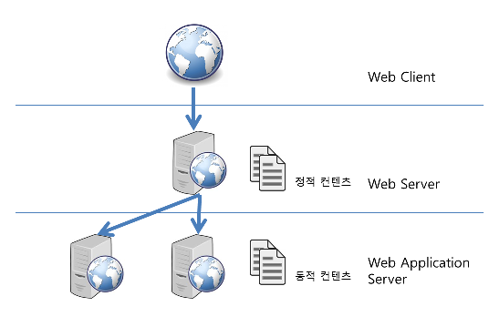

# 웹기초 이해하기2

[TOC]

---

## web 서버

소프트웨어와 하드웨어로 구분되며, 하드웨어는 말 그대로 Web 서버가 설치되어 있는 컴퓨터를 말한다. 

그리고 소프트웨어 Web 서버란 브라우저 클라이언트로 부터 HTTP 요청을 받아들이고 HTML 등의 웹 페이지 문서에 반응하는 컴퓨터 프로그램이다.

HTTP 프로토콜을 기반으로 하여 브라우저의 요청을 서비스 하는 기능을 담당한다

---

## was 서버 (web application server, 컨테이너)

HTTP를 통해 컴퓨터나 장치에 애플리케이션을 수행해주는 미들웨어(소프트웨어 엔진)이다. 

**동적 서버 콘텐츠**를 수행한다는 것으로 일반 WEB 서버와 구별되며, 주로 데이터베이스 서버와 같이 수행된다. 

한국에서는 WAS 서버로 통칭하지만 영어권에서는 Application Server로 불린다.

WEB 서버의 기능들을 구조적으로 분리하여 처리하고자하는 목적으로 제시된것, 크게 WEB 서버의 기능과 컨테이너의 기능으로 구성한다.

---

**web 서버**는 html문서같은 정적 컨텐츠를 처리하는 것(http프로토콜을 통해 읽힐 수 잇는 문서)

**was 서버**는 asp, php, jsp 등 개발언어를 읽고 처리하여 동적 컨텐츠, 웹 응용 프로그램 서비스를 처리하는 것

즉, 각각의 기능이 나누어져 있으나, 현 was서버에는 web 서버기능을 포함하고 있다.

---

## 동기, 비동기

데이터를 받는 방식에는 두가지가 있다. 동기와 비동기가 그것이다.
통신에서 상대방의 일정 신호에 의해 다음동작을 처리하는 방식을 의미

**동기(synchronous)** : 동시에 일어난다는 뜻
 요청과 그 결과가 동시에 일어난다는 약속.
 바로 요청을 하면 시간이 얼마가 걸리던 요청한 자리에서 결과가 주어져야함.

- 페이지 이동시 전체 내용이 이동처리되도록 처리

> [동기 대표 사이트 엔젤리너스](http://www.angelinus.com/About/EnterpriseIntroduce.asp)

**비동기(asynchronous)** :  동시에 일어나지 않는것.
 요청과 결과가 동시에 일어나지 않기때문에 필요에 따라 원하는 부분을 따로 호출가능

- 페이지 이동시 전체가 아닌 부분이동

> [비동기 대표사이트 잔디메신저](https://www.jandi.com/landing/kr/features)

---

## 통신프로토콜

**통신 프로토콜** 또는 **통신 규약**은 [컴퓨터](https://ko.wikipedia.org/wiki/%EC%BB%B4%ED%93%A8%ED%84%B0)나 [원거리 통신](https://ko.wikipedia.org/wiki/%EC%9B%90%EA%B1%B0%EB%A6%AC_%ED%86%B5%EC%8B%A0) 장비 사이에서 메시지를 주고 받는 양식과 규칙의 체계이다. 

통신 프로토콜은 신호 체계, [인증](https://ko.wikipedia.org/wiki/%EC%9D%B8%EC%A6%9D), 그리고 오류 감지 및 수정 기능을 포함할 수 있다.

 프로토콜은 형식, 의미론, 그리고 통신의 동기 과정 등을 정의하기는 하지만 구현되는 방법과는 독립적이다. 
따라서 프로토콜은 하드웨어 또는 소프트웨어 그리고 때로는 모두를 사용하여 구현되기도 한다.

---

### 프로토콜의 예시

- [HTTP](https://ko.wikipedia.org/wiki/HTTP) : Hyper Text Transfer Protocol : 하이퍼텍스트 전송
- [HTTPS](https://ko.wikipedia.org/wiki/HTTPS) : Secure Hyper Text Transfer Protocol : 보안 하이퍼텍스트 전송
- [FTP](https://ko.wikipedia.org/wiki/%ED%8C%8C%EC%9D%BC_%EC%A0%84%EC%86%A1_%ED%94%84%EB%A1%9C%ED%86%A0%EC%BD%9C) : File Transfer Protocol : 파일전송
- [SFTP](https://ko.wikipedia.org/wiki/SSH_%ED%8C%8C%EC%9D%BC_%EC%A0%84%EC%86%A1_%ED%94%84%EB%A1%9C%ED%86%A0%EC%BD%9C) : Secure File Transfer Protocol : 보안 파일전송
- [Telnet](https://ko.wikipedia.org/wiki/%ED%85%94%EB%84%B7) : TErminaL NETwork : 터미널 네트워크
- [POP3](https://ko.wikipedia.org/wiki/POP3) : Post Office Protocol version 3 : 우편번호
- [SMTP](https://ko.wikipedia.org/wiki/SMTP) : Simple Mail Transfer Protocol : 단순메일전송
- [SSH](https://ko.wikipedia.org/wiki/%EC%8B%9C%ED%81%90%EC%96%B4_%EC%85%B8) : Secure Shell : 보안쉘
- [SSL](https://ko.wikipedia.org/wiki/SSL) : Secure Socket Layer : 보안 소켓 레이어
- [SOAP](https://ko.wikipedia.org/wiki/SOAP) : Simple Object Access Protocol : 단순 개체 액세스
- [ARP](https://ko.wikipedia.org/wiki/ARP) : Adress Resolution Protocol : 주소 선정

---

### 프로토콜의 구성

- **물리적 측면** : 자료 전송에 쓰이는 전송 매체, 접속용 단자 및 전송 신호, 회선 규격 등.
- **논리적 측면** : 프레임(Frame, 자료의 표현 형식 단위) 구성, 프레임 안에 있는 각 항목의 뜻과 기능, 자료 전송의 절차 등.
  - **폐쇄적 프로토콜** : **자사 장치들끼리 통신**하기 위한 독자적인 통신 규약이며, 자세한 규격이 공개되어 있지 않아서 크래킹 위협에 상대적으로 안전하다. (보기: IBM의 [SNA](https://ko.wikipedia.org/wiki/SNA), [SDLC 프로토콜](https://ko.wikipedia.org/w/index.php?title=SDLC_%ED%94%84%EB%A1%9C%ED%86%A0%EC%BD%9C&action=edit&redlink=1))
  - **공개된 범용 프로토콜** : 여러 장치들에 쓰이는 **널리 알려진 규격**이며, 규격이 널리 공개되어 있기 때문에 컴퓨터와 네트워크 크래킹에 취약한 편이다. (보기: 인터넷의 TCP/IP)

---

### 프로토콜의 정의 기관

- [ISO](https://ko.wikipedia.org/wiki/ISO) (국제 표준화기구)
- [EIA](https://ko.wikipedia.org/wiki/EIA) (전자 산업기구)
- [IEEE](https://ko.wikipedia.org/wiki/IEEE) (전기 전자 학회)
- [CCITT](https://ko.wikipedia.org/w/index.php?title=CCITT&action=edit&redlink=1) (국제 전신 협의회)
- [IAB](https://ko.wikipedia.org/wiki/IAB) (인터넷 활동위원회)