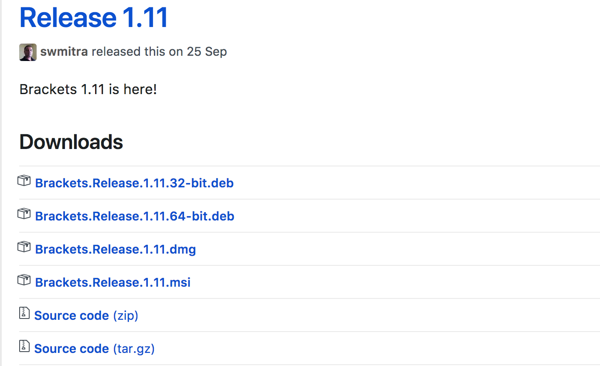

# bracksets?

웹 코드를 작성하려면 이를 작성하고 수정이 용이하도록 제작하는 에디트가 필요합니다. 
그중의 가장 쉽고 편한 에디트가 [**Bracksets**](http://bracksets.io)가 아닐까 싶습니다.


[TOC]

---

## 설치

먼저 [brackets.io](http://brackets.io) 페이지로 이동합니다. 
화면에 보이는 Download버튼을 클릭하여 해당 프로그램을 다운받은 후 설치하시면 됩니다. 



혹시 위 화면의 이미지가 보인다면 당황하지 마세요.

위 내용중 확장자를 확인하여 해당하는 OS에 맞는 것을 선택하면 됩니다. 

- windows 사용자는 확장자가 **msi**인 파일을 선택하면됩니다.
- mac 사용자는 확장자가 **dmg**인 파일을 선택하면 됩니다.
- linux 사용자는 확장자가 **deb**인 파일을 선택(시스템 파악)하면 됩니다.


---

## 기본 기능이해

brackets는 sidebar기능이 있습니다.

사용하는 프로젝트를 지정하여 필요시 사용하는 기능으로 인지하면 쉽습니다. 

- 이때 해당하는 기능을 자유롭게 켜고 끌 수 있습니다. 
  메뉴 에서 사이드바를 숨기고 켤 수 있습니다.

  ```
  메뉴 > 보기 > 사이드바 숨기기
  ```

- 사이드바에서 프로텍트를 설정한다는 의미는 사용하려는 폴더를 선택하여 지정할 수 있다는 의미입니다.
  원하는 폴더를 선택하면 됩니다. 

  ```
  사이드바 > getting started 버튼 > 폴더열기
  ```

  차후에 프로젝트 변경시에는 사이드바에서 프로젝트명의 버튼(폴더)을 클릭후 재선택하면 됩니다.

- 웹문서 작업시( **html** ) 작성한 내용을 바로 확인할 필요가 있는데, brackets에서는 실시간 미리보기 기능이 있습니다. 
  설치된 에디트의 오른쪽 상단을 보면  을 클릭하면 브라우저가 실행되면서 내용 작업시 자동 변경처리되어 저장되는 것을 알 수 있습니다. 

  - 단, 문서가 복잡해질 경우 brackets의 **미리보기기능이 느려지는 문제가 발생**하기 때문에 별도의 처리방법을 활용할 것을 권합니다. 
  - 웹서버 실시간의 변경처리시에는 node를 활용한 서버구동을 처리할 수 있는 browser-sync
  - 웹서버가 불필요한 경우에는 **플러그인 설치**를 통한 기능
  - 실시간 변경을 하지 않을 경우에는 간단한 서버구동을 처리할 수 있는 node기반의 express(supervisor)를 사용권장합니다.

  ​


---

## 추가기능 설치

실시간 미리보기 버튼 외에 별도의 버튼이 하나더 존재하는데, 이버튼의 모양  을 클릭하면 brackets의 추가적인 다양한 기능을 추가설치/삭제 처리할 수있습니다.

- `emmet` : code단축키

- `utf8 convert` : code charset 변환

- `soda theme` : brackets theme

- `document outline` : html 문서 구조파악

- `custom works` : editor 설정

- `alignment` : 코드라인 줄맞춤

- `beautify` : 전체코드 라인정리

- ​`brackets snippets(by zagino)` :  단축키 설정

- `cssfier` : html 코드를 css에서 자동설정하여 표기

- `oneliner extension` : 코드 한줄 만들기

- `Interactive Linter` : code 오류 파악하기

- ​

  ​

---

## 기타 참고사항


-  녹색의 모양은 별도의 플러그인의 업데이트기능이 있다는의미 입니다.
-   모양은 brackets의 별도 업데이트이므로 새롭게 다운받아 설치할 것을 권장합니다.
-  brackets 프로그램을 삭제 후 재설치 하더라도 플러그인이 삭제되지 않으므로 별도의 추가기능을 삭제처리해야 합니다.
-  내장기능중 실시간 미리보기 기능은 브라켓 프로그램의 성능에 영향을 받으므로 권장하지않습니다. 
-  웹페이지를 실시간으로 변경되는 기능을 확인하려면 [prepros.io](http://prepros.io)를 활용하여 사용하시기 바랍니다.

