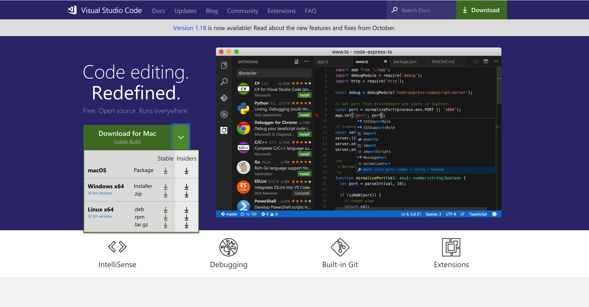
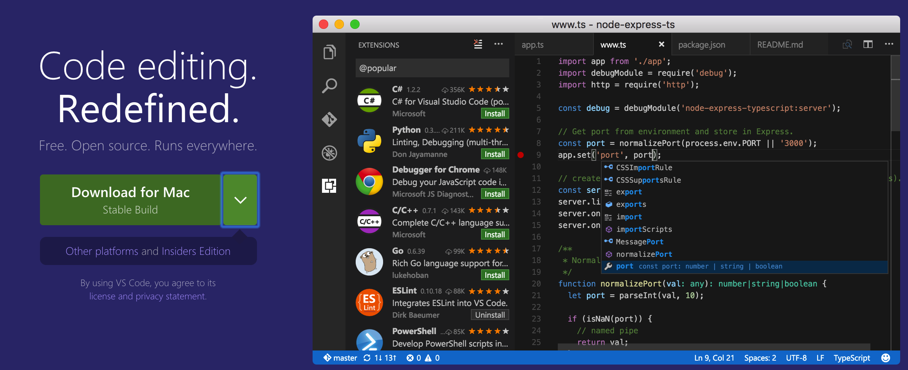
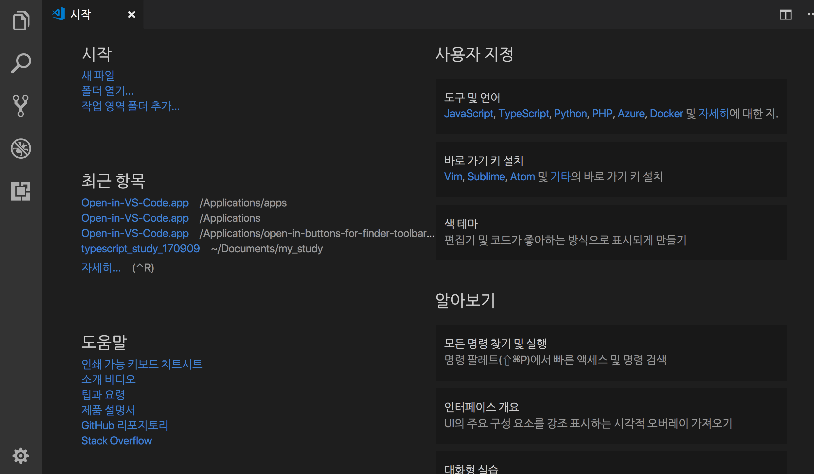

# Visual studio Code

웹 코드를 작성하려면 이를 작성하고 수정이 용이하도록 제작하는 에디트가 필요합니다. 
다양한 os에서도 문제없이 구동되고 특별한 플러그인을 설치하지 않아도 큰 문제없이 동작하는 에디트가 있습니다. 

[visual studio code](https://code.visualstudio.com/) 입니다. 
vsCode라고 불리는 edit는 microsoft에서 만든 가벼운 에디트입니다. 
가볍고 간편하지만 차세대 edit라 불리기도하며, type script를 지원하는 강력한 기능을 지니고 있기에 향후 edit가 아닌  IDE의 변환을 꾀하고 있는 프로그램 이기도 합니다.

---

[TOC]

---

## 설치

먼저 [visual studio code](https://code.visualstudio.com/) 페이지로 이동합니다. 
화면에 보이는 Download버튼을 클릭하여 해당 프로그램을 다운받은 후 설치하시면 됩니다. 

만약 사용하고있는 OS가 다르다면 다운버튼 오른쪽 화살표를 클릭하여 해당 OS에 맞게 다운 받은 후 설치하면 됩니다 .

위 내용중 확장자를 확인하여 해당하는 OS에 맞는 것을 선택하면 됩니다. 

- windows 사용자는 확장자가 **msi**인 파일을 선택하면됩니다.
- mac 사용자는 확장자가 **dmg**인 파일을 선택하면 됩니다.
- linux 사용자는 확장자가 **deb**인 파일을 선택(시스템 파악)하면 됩니다.

---

## vscode 실행

최초의 시작화면은 다음과 같습니다.

---

### 툴바의 기능

 : 탐색기의 기능으로 현재문서 설정시 파일내용을 확인할 때 사용

 : 검색의 기능으로 필요한 단어를 찾아 바꾸거나 설정할때 사용

 : **git**과의 연동시 사용할 수 있는 기능

 : 작업시 필요한 디버깅 처리시 필요

 : 프로그램 확장기능으로 다양한 package를 설치하여 사용할 수 있다.

 : 각종 설정기능

---

## 기본 기능이해

vscode는 sidebar기능이 있습니다. 탐색기 기능입니다. 
위에서 언급한 내용으로 다양한 파일을 열어 사용할때 쓰이는 기능입니다.

이때 오른쪽 상단의  

 아이콘을 클릭하면 열려있는 문서외에도 2이상의 문서를 분할하여 동시에 사용할 수 있습니다. 

---

## 추가기능 설치

 을 클릭하면 vscode프로그램의 다양한 기능을 설치하여 사용할 수 있습니다. 
다음은 여러 package 중 사용해본 대표 기능을 몇가지를 소개하겠습니다.

- `open in browser`

- `beautify`

- `alignment`

- `vs color picker`

- `px to rem`

- `insert number`

  ​

---

## 기타 참고사항

-  `menu>보기>통합터미널`  : 터미널 실행 기능입니다. 

-  `ctrl + shift + p` : 입력후 `shell` 글자를 입력하면 아래와 같은 버튼이 나타납니다.

   

   - 위내용에서 설치버튼을 클릭하면 shell에서 `code .` 입력으로 VSCODE가 실행됩니다. 