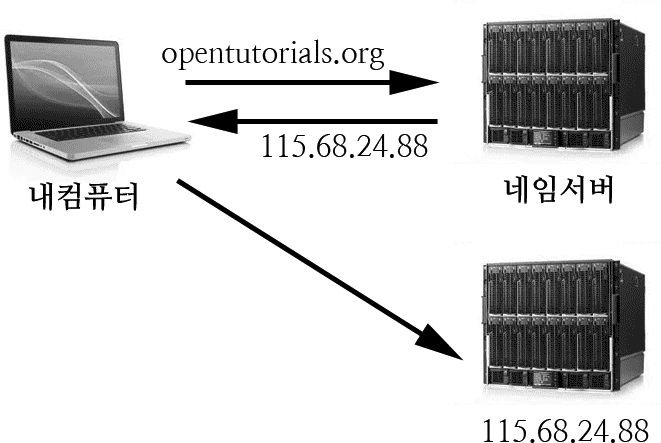

# 웹 기초 이해하기 1

[TOC]

## 1. 네트워크란?

컴퓨터와 각종 통신장비들이 서로 연결되어 정보를 주고 받거나 자원을 공유할 수 있도록 구성된 통신망


------

### 네트워크 통신의 장점

- 능률적 통신: 전자우편, 메신저 등을 통해 빠르고 편리하게 통신할 수있다.
- 장치공유: 프린터, 스캐너 등과 같은 컴퓨터 주변장치를 네트워크로 연결하여 공동으로 사용.
- 자료 동시 접근: 데이터를 서버 및 클라우드에 저장한 후 공유해놓으면 많은 사용자가 동시에 사용가능
- 손쉬운 자료보관: 네트워크를 통해 서버의 저장공간에 자료를 백업해 놓으면 컴퓨터의 장애가 생겨도 자료를 안전하게 보호할 수 있다.

------

### 네트워크 구성방식

- **p2p방식(peer to peer)** : 컴퓨터들이 서로 동등한 권한으로 연결되어 컴퓨터의 자원을 서로 공유하는 방식
  별도의 서버가 없고 각 컴퓨터가 서버, 클라이언트역할을 함
- **호스트터미널방식** : 모든 정보처리가 호스트에서 이루어짐 터미털에서는 독자적으로 데이터를 처리할 수 없고 단지 입출력만 할 수 있다.
- **클라이언트,서버방식** : 클라이언트는 서버에게 작업을 요청하고, 서버는 요청된 작업을 처리하여, 클라이언트에게 제공하는 방식(일반적으로 사용하는 인터넷을 사용하는 방식)


---

### 네트워크 전송방향

- 단방향
- 양방향
  - 반이중 통신
  - 전이중 통신

------

#### 1. 단방향 통신

송신측과 수신 측이 고정되어있는 방식으로 한쪽방향으로만 데이터를 전송할 수 있다.

> 라디오, 텔레비전 등의 한쪽 방향으로만 통행이 가능한 일방통행기능

#### 2.1 반이중통신

양방향 통신이 가능하지만 동시에 양방향에서 전송할 수는 없는 방식

> 무전기와 같이 교대로 통신하는 방식

#### 2.3 전이중 통신

두개의 채널을 이용하여 양방향으로 동시에 송수신 할 수 있는 방식.
전화는 통화하는 사람이 동시에 말을 할 수 있다.

> 전화


------

### 네트워크 분류

망의 규모에 따라 분류

- 망규모

  - **근거리 통신망(LAN)** : 학교전산실, 실습실, 교무실등의 가까운지역
  - **도시권 통신망(MAN)** : 한 도시내의 네트워크를 하나의 거대한 네트워크로 연결
  - **원거리 통신망(WAN)** : 지역과 지역, 국가와 국가간의 광범위한 지역을 연결하는 통신망

- 망의 운영목적

  - **부가가치 통신망** : 홈쇼핑, 홈뱅킹 등 통신사업자로부터 통신회선 임대하여 하나의 사설망구축
  - **종합 정보 통신망** : 영상전화, 유선방송등 여러개의 통신망을 하나의 통신망으로 통합하여 다양한 서비스 제공

  ​

---

## 2. 도메인에대해 알아보자!

### IP란?

인터넷에서 연결되어 있는 장치( 컴퓨터 스마트폰, 타블렛, 서버 등…) 들은각각의 장치를 식별할 수 있는 주소를 가지고 있는데 이를 ip라고 한다.

- 일종의 지도상의 존재하는 위도(latitude)/경도(longtitude) 라고 볼 수 있다.
- [위도경도로 학원 위치찾아보기](https://www.google.com/maps/place/%EA%B7%B8%EB%A6%B0%EC%BB%B4%ED%93%A8%ED%84%B0%EC%95%84%ED%8A%B8%ED%95%99%EC%9B%90+%EC%88%98%EC%9B%90%EC%BA%A0%ED%8D%BC%EC%8A%A4/@37.267076,127.000759,17z/data=!3m1!4b1!4m5!3m4!1s0x357b431949018737:0x894cec2bd06a3a89!8m2!3d37.2670718!4d127.0029477?hl=ko-KR)

> 115.69.24.88
>
> 192.168.0.1


---

### 도메인이란?

ip는 사람이 이해하고 기억하기란 어렵기 때문에 이를 위해서 각 ip에 이름을 부여할 수 있게 했는데 이것을 도메인 이라고 한다.

- 지도상의 위도/경도를 이해하기 쉽도록 주소를 달아놓은 것으로 이해할 수 있다.
- [학원주소 찾아보기](http://www.juso.go.kr/openIndexPage.do)
- [세계를 3개의 단어로 주소만들기](https://what3words.com/)
  - what3words라는게 있어요!-[이야기들어보기](http://www.bloter.net/archives/257156)


---

### url이란?

도메인주소(http://daum.net) 뒤에오는 추가내용이 포함된 주소를 
url 이라고 부른다.

- **domain** : http://www.danawa.com/
- **url** : http://prod.danawa.com/list/?cate=112758&searchOption=btnAllOptUse=true/searchMaker%5B%5D=1452/innerSearchKeyword=


---

### 호스팅이란?

**제공자 등의 사업자가 주로 개인 홈페이지의 서버 기능을 대행하는 것**.

 **기업의 대용량 메모리 공간 일부를 이용하여 사용자의 홈페이지나 웹 서버 기능을 대행하는 서비스.** 
이로써 사용자는 웹 서버의 운영 관리와 고속 전용선을 상시 사용하므로 회선 사용료의 부담을 줄일 수 있다. 
사용자가 가진 도메인에서 홈페이지 개설부터 서버 관리까지 대행해주므로 독자 도메인 서비스라고도 한다. 
한편, 서버를 갖고 있지 않은 사용자에게 웹 사이트나 서버 기능을 대여하는 것을 렌탈 서버(rental server)라고 한다.


---

### 호스트란?

컴퓨터 네트워크와 원거리 통신에서 프로그램이나 데이터 파일을 다른 컴퓨터에서 사용할 수 있도록 하는 등 중앙 집중적인 기능을 수행하는 컴퓨터. 
**호스트** 컴퓨터에 연결한 사용자는 전자 우편과 텔넷, 그리고 FTP와 같은 응용 프로그램을 사용하여 원하는 서비스를 요청할 수 있다.

- 네트웍에 연결되어 있는 컴퓨터를 호스트라고 한다.
- 내컴퓨터 호스트주소(ip)는? <http://locallhost.com/>


---

### 호스트설정이란?

도메인을 호스트의 ip에 연결하는 행위

- 개인/사업체가 가지고 있는 도메인의 주소를 웹페이지를 제작한 ip에 연결하여 웹사이트로 구축되게 만드는 것


---

### 클라이언트와 서버

**클라이언트** : 서비스를 사용하는 사용자 혹은 사용자의 단말기

**서버** : 서비스를 제공하는 컴퓨터, 다수의 클라이언트를 위해 존재하기 때문에 일반적으로 매우 큰 용량과 성능을 가지고 있다.


---

### 포워딩

도메인으로 접근한 사용자를 다른 도메인으로 보내는 행위

> 접속을 **http://google.com/fonts**으로 접속했지만 실제로 주소는
> **http://fonts.google.com** 으로 변경되어 접속되게 만드는 기능

#### 호스트설정 vs 포워딩

- 호스트 설정은 도메인과 ip를 연결시키는 것,

  ```shell
  $ nslookup naver.com
  ```

> 네이버 : 125.209.222.142

포워딩은 다른 도메인으로 보내는것(즉, 포워딩한 사용자의 URL이 변경된다.)

> google.com/fonts : fonts.google.com


---

### 네임서버(DNS-domain name server)

**도메인에 해당하는 ip를 알려주는 서비스**

즉, 도메인의 주소를 입력하면 네임서버에서는 ip주소를 알려주고
실제로 ip주소로 접속하도록 처리하게 만드는것




---


