# GRID system

---

[TOC]

---

## 그리드 시스템이란?

### 그리드(grid):

그리드의 사전적 뜻은 격자, 바둑판의 눈금을 의미합니다. 
그리드는 판면을 구성할 때 쓰이는 가상의 격자의 안내선이라고 합니다. 

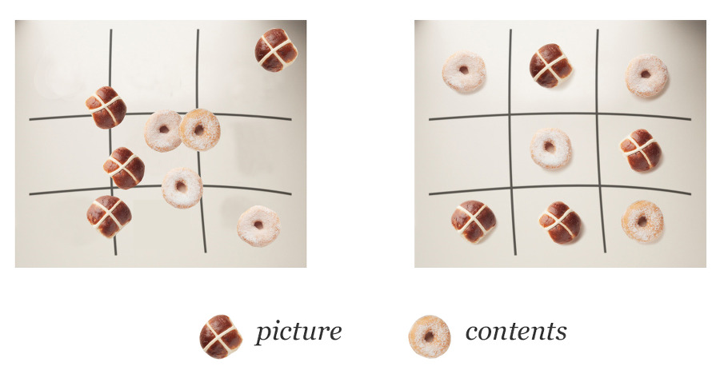			

위 그림을 보면 어떠한 격자형태를 기준으로 정리해놓은 형태입니다. 
그리드는 위그림처럼 정리를 좀 더 잘 하기위한 방법이라고 볼 수 있습니다.

---

### 최초시작:

그리드 시스템은 제일 처음 **건축에서 개발단계에서 구획을 나눌 때**  사용되었고,
그후 타이포그라피에서 활용되다가 1930년경 신문잡지등에서
그리드 시스템은 신문, 잡지 등에서 기사,사진 등 컨텐츠 등을 **효율적**으로 구성하기 위해 사용하였습니다. 

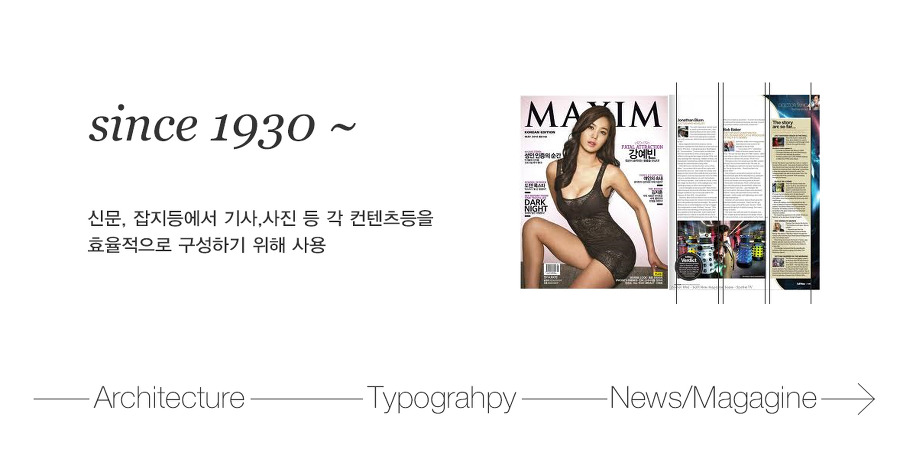

웹의 경우 인터넷이 활성화 되기 시작하면서, 
2000년대 초반부터 후반까지 **1024**모니터의 크기가 대세였습니다.
한국에서 대부분의 사용자 화면의 크기였죠.

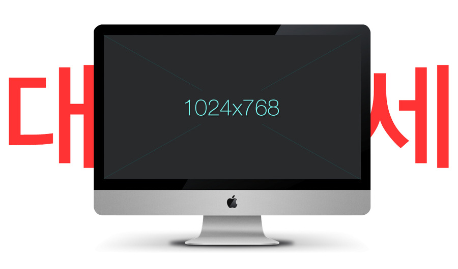

그래서 이 기간동안 화면에 복잡한 정보를 어떻게 하면 잘 보여줄까 하는 것에대한 연구가 진행되었고, 

그에따른 가장 보편적으로 사용된 시스템이 **960가이드 시스템**입니다. 
이때 사용된 컬럼이 12, 16, 24 이며 **보통 12 또는 16컬럼**을 사용합니다.

- 하지만 이는 보편화된 수치일뿐이지, 절대숫자는 아닙니다.

- 현재에도 **desktop** 모니터의 가장 작은 수치의 기준은 **1024**입니다. 

---

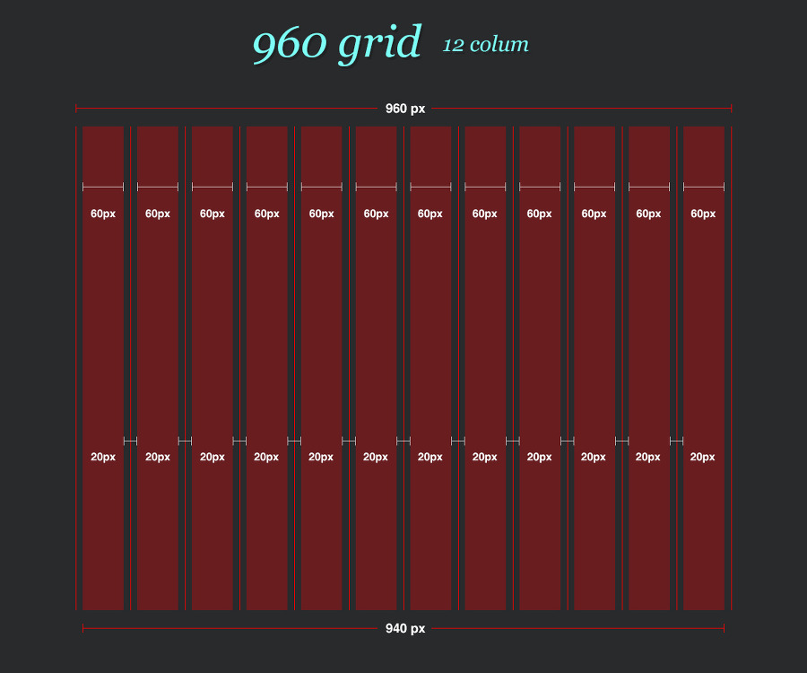

---

#### 연도에 따른 모니터 해상도 사용률_01

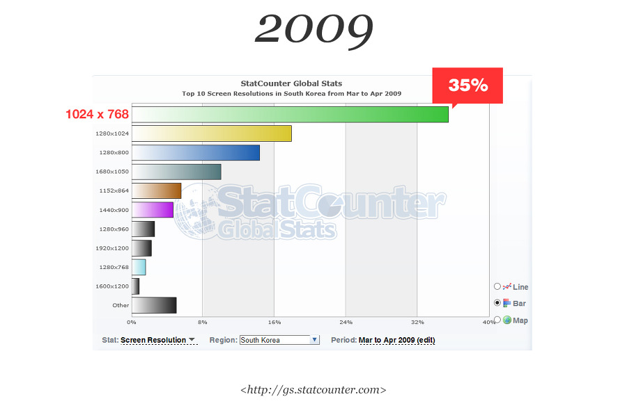

**statcount_2009_모니터 해상도 사용률**

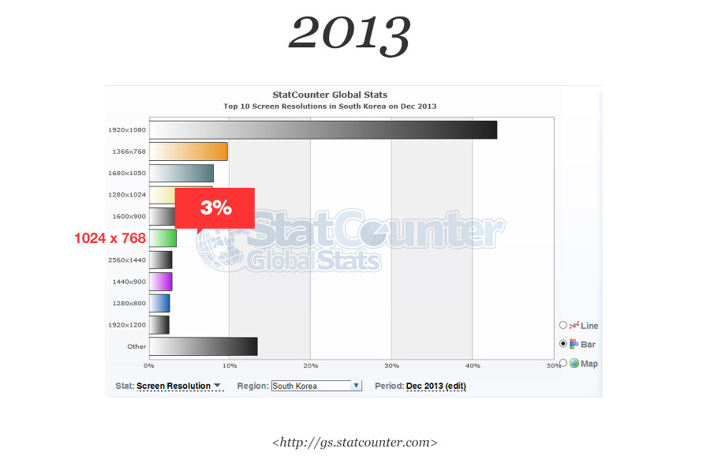

**statcount_2013_모니터 해상도 사용률**

---

#### 연도에 따른 모니터 해상도 사용률_02

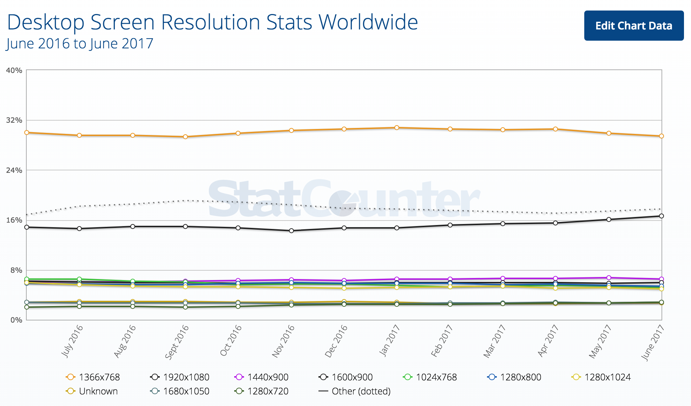

**statcount_2017_모니터 해상도 사용률**

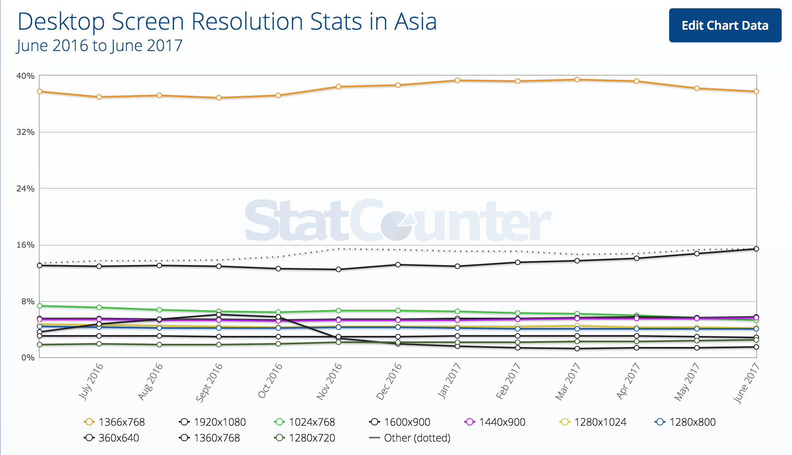

**statcount_2017(아시아)_모니터 해상도 사용률****

[참조 statcount](http://gs.statcounter.com/screen-resolution-stats/desktop/asia)

사실 현시점에서 가장 많이 사용하고 있는 모니터는 **1920** 입니다.
1024해상도는 **약 3%정도 비율**밖에 되지 않습니다.

---

### 그렇다면 960이 사용된 이유는? 

가장 많은 수로 나눌 수 있으며 **가장 계산하기 쉬운 수치**이기 때문입니다.
이는 **960수치는 1024 기준**으로 사용되어진 크기입니다. 
또한 **모니터의 크기에서 가장 작은 크기의 기준**이기 때문입니다. 

---

그리고 사실 지금은 **다양한 디바이스**에 대해 이해하고 사용해야하는 상황입니다. 

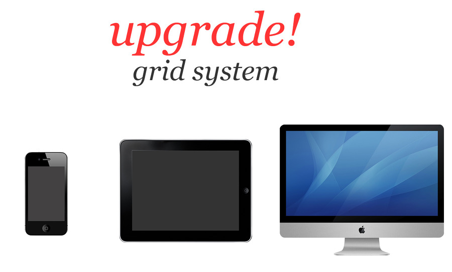

---

다양한 해상도가 현재는 존재합니다. 여러가지 방법으로 각 디바이스들에 대응하고 있습니다.

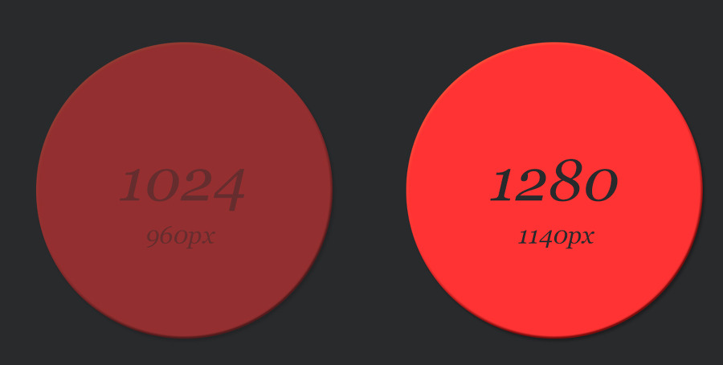

우리는 기준이 되었던 1024보다 넓은 **1280px**에서 많은 컨텐츠들을 보여줄 수 있는 방법이 필요합니다.

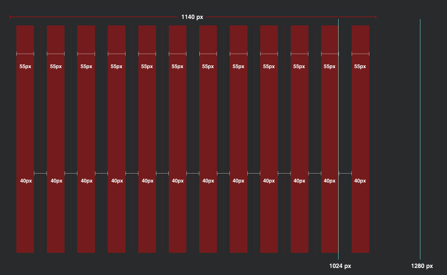

---

그럼 1024 해상도를 쓰는 사람들은 어떻합니까. 컨텐츠가 잘려 보일텐데요

1280에 맞는 그리드시스템이 여러가지 연구되었고,
1140은 960px의 연장선이라는 점에서 활용이 가능합니다. 
1280해상도에서는 총 12개의 그리드를 보여주고,
 1024해상도로 변경되었을때는 끝의 두 컬럼을 삭제하거나 밑으로 내리는 방식입니다. 

---

1280 모니터에서 보여주는 **GS shop**

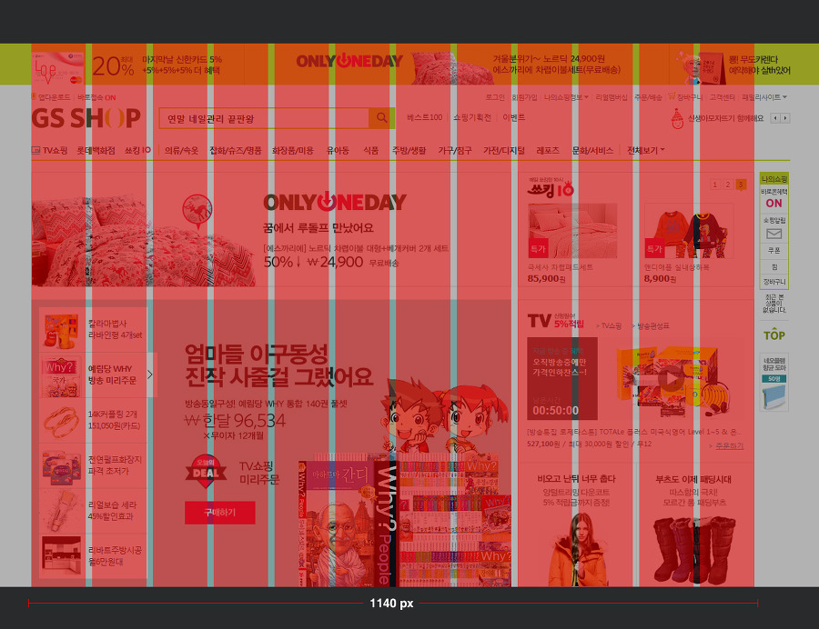

---

1024모니터에서 보여주는 **GS shop**

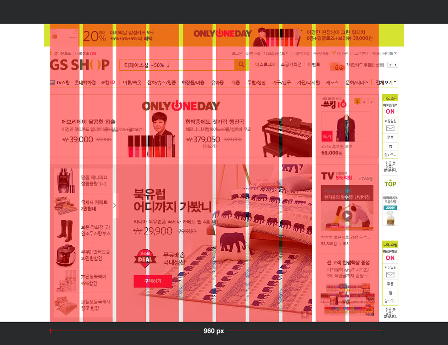

---

## 왜 사용할까?

그리드 시스템은 **한정된 공간 안에서 레이아웃을 배치하는데 도움**을 줍니다. 
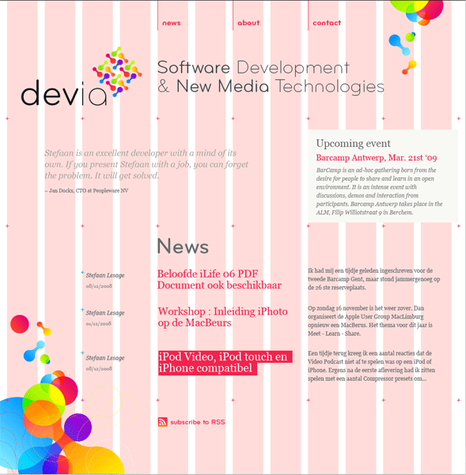

---

레이아웃의 **큰 축을 이루는 텍스트들은  12단계의 그리드**에 포함되어 있는 것을 확인할 수 있습니다. 

언뜻 보면 움직임의 제약이 많아보이지만, **오히려 이러한 제약이 일관되고 안정된 디자인**을 하는데 도움이 됩니다. 
틀이 잡혀 있는 그리드 시스템은 **디자인 과정을 보다 간단하고 명료**하게 해주며, 디자인 작업을 빠르고 편리하게 해줍니다. 즉, 그리드 시스템은 디자인 방법의 하나로 보다 객관적이고 합리적으로 작업할 수 있도록 해줍니다.

---

### 그리드 시스템의 최대 장점

그리드 시스템의 최대 장점은 표준화 작업이 가능하다는 것입니다. 

같은 그리드에 제작된 배너나 그 영역은
메인이든 서브든 어느곳이든 넣을수만 있다면 손쉽게 적용이 됩니다.

이게 최대 장점이지만.
현재는 **반응형 웹으로 제작되면서 훨씬 더 쉽게 응용**이 가능해 졌지요.
하지만 **반응형 웹의 단점은 익스플로러나 크롬  타 브라우저모두 버전에 영향**을 많이 받아요~

---

### 그리드 시스템의 역할과 장점

- 그리드 시스템으로 더 좋은 구조를 만들 수 있습니다.
- 디자인의 위치에 대해 적절한 지침을 내려줍니다.
- 가독성과 주목성을 더 향상시킬 수 있습니다.

---

## 이제 그리드에 대해 알았다면 더 공부해야하는 분야

- 우리가 더 알아야 하는 그리드이야기 : [8pt grid](https://spec.fm/specifics/8-pt-grid)

- 우리가 더 알아야하는 밀도 이야기: [픽셀밀도(Pixel Density)](https://brunch.co.kr/@blackindigo-red/18)
- 우리가 더 알아야하는 반응형 웹이야기: [반응형웹 슬라이드](https://www.slideshare.net/saltluxzinyus/ux-pd-16169213?qid=c1a242fb-2e17-448e-874d-7568f85dbdf5&v=&b=&from_search=3)

---

##### 출처:[캠핑&보트 타는 웹디자이너 블로그](http://inmoon99.tistory.com/34), [아임웹](https://imweb.me/faq?mode=view&page=6&category=29&category2=0&idx=189)

## 